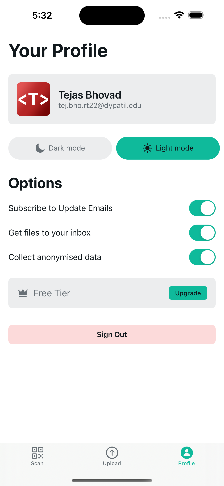
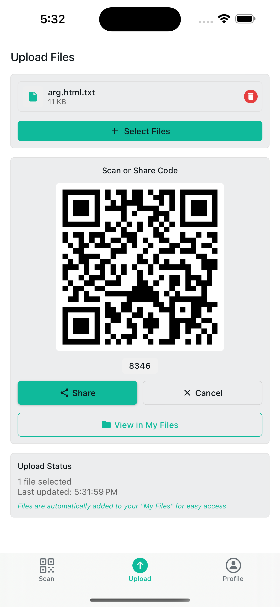
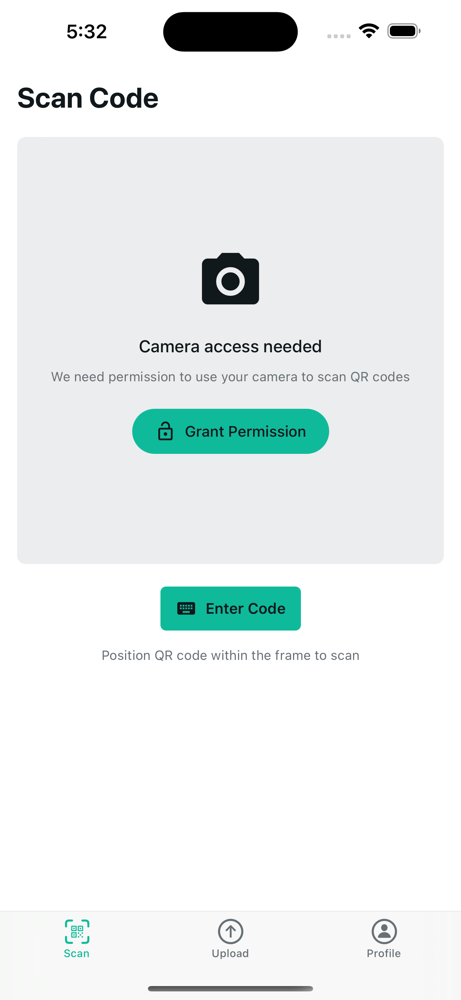

# Remote Upload Mobile App

This is a simple mobile app that wraps the functionality of the [Remote Upload](https://github.com/TejasBhovad/remote-upload) website. It allows you to share files with QR to other devices.

> This project is still in development and is not yet ready for production use.

<div align="center">
  
  
  
</div>

## Starting the app

```bash
npm install
npm run expo start
```

## Tech Stack

- **[Expo](https://expo.dev/)**: React Native framework for cross-platform mobile development
- **[UploadThing](https://uploadthing.com/)**: File upload and storage service
- **[NativeWind](https://www.nativewind.dev/)**: Tailwind CSS for React Native
- **[Clerk](https://clerk.com/)**: Authentication and user management

## Contributing

Contributions are welcome! Please feel free to submit a Pull Request.

## Related Projects

- [Remote Upload Web](https://github.com/TejasBhovad/remote-upload) - The web version of this application

## Acknowledgements

- [Clerk Documentation](https://clerk.com/docs/components/unstyled/sign-out-button)
- [Expo Documentation](https://docs.expo.dev/)
